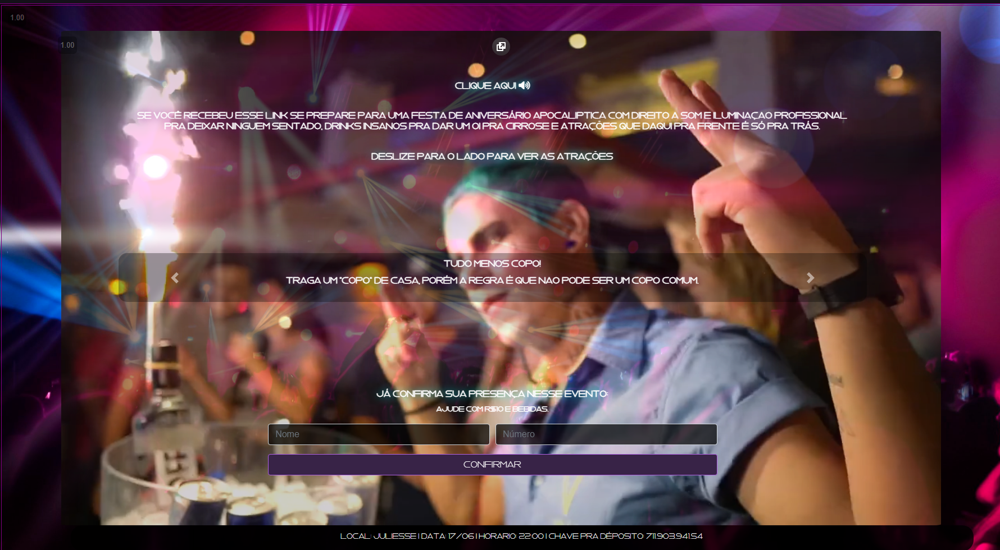

<a href="https://bot.nkwtech.com/index.php" target="blank">Convite_de_festa</a>

## Sobre 

O "Convite de Festa" é uma página simples interativa com o usuário para fazer a gestão de convidados, os mesmo podem colocar seu nome e número e confirmarem presença no evento, veja suas capacidades:

- Conexão com o banco de dados.
- Totalmente estilizada com html, css e bootstrap.
- Facil manutenção do código.
- Design elegante.
- Interativa.

O "Convite de Festa" é uma página que desenvolvi em 12 horas para um amigo.

## Veja aqui um pouco da página 

